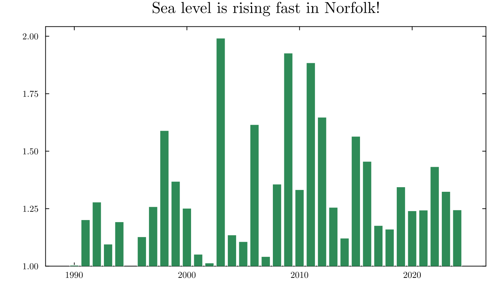

::: {.callout-important icon=false}
### Due: Thursday 4 February 2027, 9:00pm Eastern

Submit a PDF to Gradescope with **each sub-part tagged**. Untagged submissions lose 10%.

**20 points.** Problems 1 and 2 are pen-and-paper (14 points). Problem 3 is computational (6 points).
:::

## Problem 1 — What makes a model generative (7 points)

**(a) (2 points)** In your own words, what makes a statistical model **generative**? Your answer
should say what a generative model lets you do that a curve fitted through points does not.

**(b) (3 points)** A colleague measures the depth of water in a street after each of 40 rainstorms.
They tell you: *"depth increases with rainfall, roughly linearly, but there's a lot of scatter, and
it can never go below zero."*

Write down a generative model for these data. State **every** assumption you are making, and mark
which ones came from your colleague's sentence and which you supplied yourself.

**(c) (2 points)** Two datasets have identical means, variances, and correlation, but were produced
by different processes. What does that tell you about the value of summary statistics for deciding
between competing explanations — and what would you look at instead?

## Problem 2 — Reading and criticising a figure (7 points)

The figure below was produced from the Sewells Point tide gauge record you will meet in Problem 3.

{width=90%}

**(a) (4 points)** Identify **four** distinct problems with this figure. For each, say in one phrase
what it does to the reader's impression of the data. At least one of your four should concern the
choice of **mark** (bars) rather than the axes or the labelling.

**(b) (2 points)** The record runs from 1928. This figure starts at 1990. Give one legitimate reason
an analyst might restrict the range, and say what the figure would need to include for that choice to
be defensible.

**(c) (1 point)** Rewrite the title so that it describes what the figure shows rather than what the
author wants you to conclude.

## Problem 3 — First contact with the gauge record (6 points)

`data/sewells_point_hourly.csv` holds hourly water levels at Sewells Point, Virginia (NOAA station
8638610), 1928–2024, in metres relative to mean sea level. Columns: `date`, `time_gmt`,
`water_level_m`. Rows with no observation have been removed, so **the number of rows in a year is the
number of hours actually recorded**.

**(a) (2 points)** Read the file. Report the number of rows, the date range, and the number of
distinct years.

**(b) (2 points)** Group by year and compute the annual maximum. A complete year has 8,760 or 8,784
hours. **You decide what counts as an incomplete year** — state your threshold, say why you chose it,
and report how many years fall below it.

**(c) (2 points)** Produce one figure of annual maximum against year that does not commit any of the
faults you identified in Problem 2, marking the years you called incomplete. Then, in **one or two
sentences**: would you use the incomplete years in an analysis of extreme water levels? Say what you
would need to know to decide.

::: {.callout-note}
Keep your annual maxima. Homework 2 uses them.
:::
